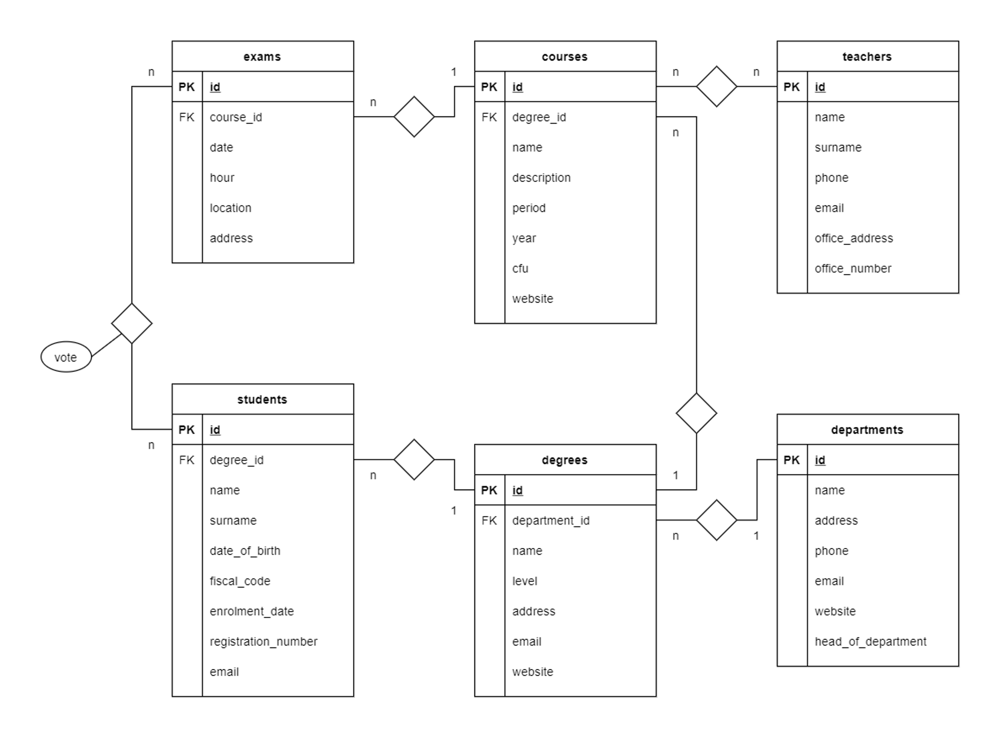

# DB University (Group & Inner Join)

_db-university_



## Group

1. Contare quanti iscritti ci sono stati ogni anno.
2. Contare gli insegnanti che hanno l'ufficio nello stesso edificio.
3. Calcolare la media dei voti di ogni appello d'esame.
4. Contare quanti corsi di laurea ci sono per ogni dipartimento.

```sql
-- 1. Contare quanti iscritti ci sono stati ogni anno.
SELECT YEAR(`enrolment_date`), COUNT(*)
FROM `students`
GROUP BY YEAR(`enrolment_date`);
```

```sql
-- Seleziona l'anno di enrolment_date e **conta** tutto
SELECT YEAR(`enrolment_date`), COUNT(*)
-- dalla tabella studenti...
FROM `students`
-- raggruppando per l'anno di arruolamento.
GROUP BY YEAR(`enrolment_date`);
```

<hr>
