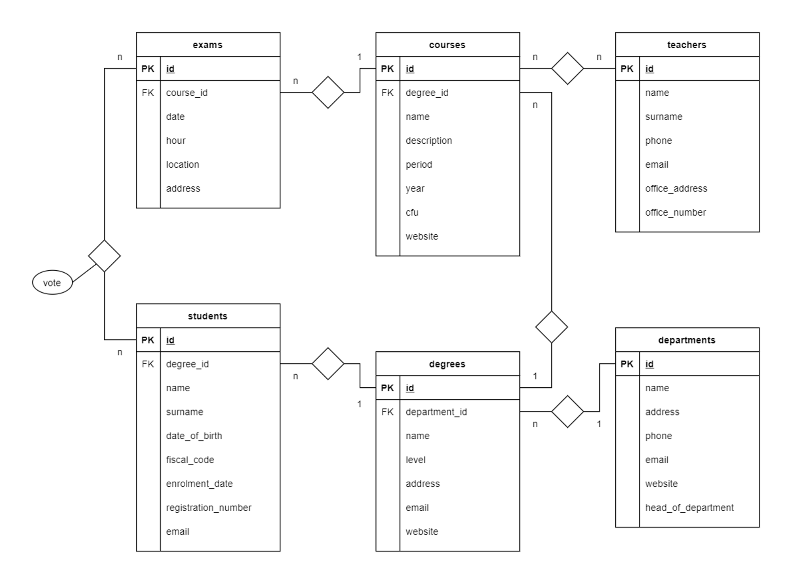

# DB University (Group & Inner Join)

_db-university_



## SQL Group By - TASKS

1. Contare quanti iscritti ci sono stati ogni anno.
2. Contare gli insegnanti che hanno l'ufficio nello stesso edificio.
3. Calcolare la media dei voti di ogni appello d'esame.
4. Contare quanti corsi di laurea ci sono per ogni dipartimento.

```sql
-- 1. Contare quanti iscritti ci sono stati ogni anno.
SELECT YEAR(`enrolment_date`), COUNT(*)
FROM `students`
GROUP BY YEAR(`enrolment_date`);
```

```sql
-- Seleziona l'anno di enrolment_date e **conta** tutto
SELECT YEAR(`enrolment_date`), COUNT(*)
-- dalla tabella studenti...
FROM `students`
-- raggruppando per l'anno di arruolamento.
GROUP BY YEAR(`enrolment_date`);
```

<hr>

```sql
-- 2. Contare gli insegnanti che hanno l'ufficio nello stesso edificio.
SELECT `office_address` AS `office_name`, COUNT(*)
FROM `teachers`
GROUP BY `office_address`;
```

```sql
-- Seleziona tutti gli indirizzi di ufficio e dai il nome d'ufficio, poi contali tutti
SELECT `office_address` AS `office_name`, COUNT(*)
-- dall'interno della tabella teachers
FROM `teachers`
-- e raggrupparli per indirizzi di ufficio di appartenenza.
GROUP BY `office_address`;
```

<hr>

```sql
-- 3. Calcolare la media dei voti di ogni appello d'esame.
SELECT  `exam_id` "appello_esame", AVG(`vote`) "media_voti"
FROM `exam_student`
GROUP BY `exam_id`;
```

<hr>

```sql
-- 4. Contare quanti corsi di laurea ci sono per ogni dipartimento.
SELECT `department_id` "Department", COUNT(*) "Number_of_degrees"
FROM `degrees`
GROUP BY `department_id`
ORDER BY `Department`  ASC
```

<hr>

## SQL _INNER JOIN_ - TASKS

1. Selezionare tutti gli studenti iscritti al Corso di Laurea in Economia.
2. Selezionare tutti i Corsi di Laurea Magistrale del Dipartimento di
   Neuroscienze.
3. Selezionare tutti i corsi in cui insegna Fulvio Amato (id=44).
4. Selezionare tutti gli studenti con i dati relativi al corso di laurea a cui
   sono iscritti e il relativo dipartimento, in ordine alfabetico per cognome e
   nome.
5. Selezionare tutti i corsi di laurea con i relativi corsi e insegnanti.
6. Selezionare tutti i docenti che insegnano nel Dipartimento di
   Matematica (54).
7. BONUS: Selezionare per ogni studente il numero di tentativi sostenuti
   per ogni esame, stampando anche il voto massimo. Successivamente,
   filtrare i tentativi con voto minimo 18.

```sql
-- 1. Selezionare tutti gli studenti iscritti al Corso di Laurea in Economia.
SELECT `students`.`surname`, `students`.`name`,`students`.`registration_number`, `degrees`.`name` AS "Corso_di_Laurea"
FROM `students`
INNER JOIN `degrees`
ON `students`.`degree_id` = `degrees`.`id`
WHERE `degrees`.`name` = "Corso di Laurea in Economia";
```

```sql
-- Seleziona Cognome e nome e codice studente + Nome del corso come "corso di laurea"
SELECT `students`.`surname`, `students`.`name`,`students`.`registration_number`, `degrees`.`name` AS "Corso_di_Laurea"
-- dentro la tabella studenti
FROM `students`
-- collegati alla tabella degrees
INNER JOIN `degrees`
-- il deegre_id di studenti deve essere uguale all'id di degrees
ON `students`.`degree_id` = `degrees`.`id`
-- deegrees . name deve essere uguale a Corso di Laurea in economia
WHERE `degrees`.`name` = "Corso di Laurea in Economia";
```

<hr>
feat: add Task 1 (Inner Join)

```sql
-- 2. Selezionare tutti i Corsi di Laurea Magistrale del Dipartimento di Neuroscienze.
SELECT `degrees`.`name`, `degrees`.`level`, `departments`.`name` AS "Dipartimento"
FROM `degrees`
INNER JOIN `departments`
ON `degrees`.`department_id` = `departments`.`id`
WHERE `degrees`.`level` = "magistrale"
AND `departments`.`name` = "Dipartimento di Neuroscienze";

```

<hr>

```sql
-- 3. Selezionare tutti i corsi in cui insegna Fulvio Amato (id=44).
-- Seleziono nome e cognome insegnante e nome del corso.
SELECT `teachers`.`name`, `teachers`.`surname`, `courses`.`name` AS "Nome_del_corso"
-- dalla tabella teachers prendo le info dell'insegnante.
FROM `teachers`
-- dalla tabella course_teacher(ponte) mi collego all'id dell'insegnante.
INNER JOIN `course_teacher`
ON `teachers`.`id` = `course_teacher`.`teacher_id`
-- dalla tabella courses mi collego all'id dell'insegnante dalla tabella ponte.
INNER JOIN `courses`
ON `course_teacher`.`course_id` = `courses`.`id`
-- infine dichiaro l'id dell'insegnante che mi interessa filtrare.
WHERE `teachers`.`id` = 44;

```

<hr>

```sql
-- 4. Selezionare tutti gli studenti con i dati relativi al corso di laurea a cui sono iscritti e il relativo dipartimento, in ordine alfabetico per cognome e nome.
SELECT `students`.`surname`, `students`.`name`, `degrees`.`name` AS "Nome Corso", `departments`.`name` AS "Nome Dipartimento"
FROM `students`
INNER JOIN `degrees`
ON `students`.`degree_id` = `degrees`.`id`

INNER JOIN `departments`
ON `degrees`.`department_id` = `departments`.`id`
ORDER BY `students`.`surname` ASC;
```

<hr>

```sql
-- 5. Selezionare tutti i corsi di laurea con i relativi corsi e insegnanti.
SELECT `teachers`.`surname`, `teachers`.`name`, `degrees`.`name` AS "Corso di Laurea", `courses`.`name` "Corso"
FROM `course_teacher`
INNER JOIN `teachers`
ON `teachers`.`id` = `course_teacher`.`teacher_id`
INNER JOIN `courses`
ON `courses`.`id` = `course_teacher`.`course_id`
INNER JOIN `degrees`
ON `degrees`.`id` = `courses`.`degree_id`
ORDER BY `teachers`.`surname` ASC;
```

<hr>

```sql
-- 6. Selezionare tutti i docenti che insegnano nel Dipartimento di Matematica (54).

```

<hr>

```sql
-- 7. BONUS: Selezionare per ogni studente il numero di tentativi sostenuti per ogni esame, stampando anche il voto massimo. Successivamente, filtrare i tentativi con voto minimo 18.

```

<hr>
