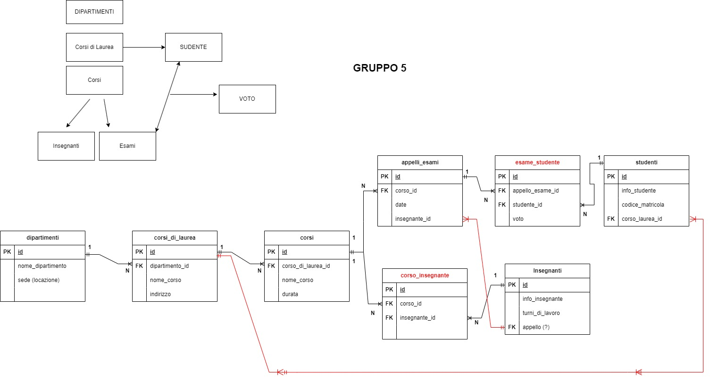

## db-university (Gruppo 5)

Modellizzare la struttura di un database per memorizzare tutti i dati riguardanti una università:

- sono presenti diversi `Dipartimenti` (es.: Lettere e Filosofia, Matematica, Ingegneria ecc.);
- ogni `Dipartimento` offre più `Corsi di Laurea` (es.: Civiltà e Letterature Classiche, Informatica, Ingegneria Elettronica ecc..)
- ogni `Corso` di Laurea prevede diversi Corsi (es.: Letteratura Latina, Sistemi Operativi 1, Analisi Matematica 2 ecc.);
- ogni `Corso` può essere tenuto da diversi `Insegnanti`;
- ogni `Corso` prevede più appelli d'Esame;
- ogni `Studente` è iscritto ad un solo Corso di Laurea;
- ogni `Studente` può iscriversi a più appelli di `Esame`;
- per ogni appello d'`Esame` a cui lo `Studente` ha partecipato, è necessario memorizzare il voto ottenuto, anche se non sufficiente.
  Pensiamo a quali entità (tabelle) creare per il nostro database e cerchiamo poi di stabilirne le relazioni. Infine, andiamo a definire le colonne e i tipi di dato di ogni tabella.



## db-university (SQL)

> Dopo aver creato un nuovo database nel vostro phpMyAdmin e aver importato lo schema allegato, eseguite le query del file allegato:

1. Selezionare tutti gli studenti nati nel 1990 (160)
2. Selezionare tutti i corsi che valgono più di 10 crediti (479)
3. Selezionare tutti gli studenti che hanno più di 30 anni
4. Selezionare tutti i corsi del primo semestre del primo anno di un qualsiasi corso di
   laurea (286)
5. Selezionare tutti gli appelli d'esame che avvengono nel pomeriggio (dopo le 14) del
   20/06/2020 (21)
6. Selezionare tutti i corsi di laurea magistrale (38)
7. Da quanti dipartimenti è composta l'università? (12)
8. Quanti sono gli insegnanti che non hanno un numero di telefono? (50)

<hr>

```sql
-- 1. Selezionare tutti gli studenti nati nel 1990 (160) Count Confirmed
SELECT * FROM `students` WHERE `date_of_birth` LIKE "1990-%";
```

```sql
-- 2. Selezionare tutti i corsi che valgono più di 10 crediti (479) Count Confirmed
SELECT * FROM `courses` WHERE `cfu` > '10';
```

```sql
-- 3. Selezionare tutti gli studenti che hanno più di 30 anni
SELECT YEAR(`date_of_birth`), `name`, YEAR(CURRENT_DATE()) - YEAR(`date_of_birth`) AS 'Anni'
FROM `students`
WHERE YEAR(CURRENT_DATE()) - YEAR(`date_of_birth`) >= '30';
```

```sql
-- 4. Selezionare tutti i corsi del primo semestre del primo anno di un qualsiasi corso di laurea (286)
SELECT * FROM `courses` WHERE `period` = "I semestre" AND `year` = "1";
-- SELECT COUNT(*) FROM `courses` WHERE `period` = "I semestre" AND `year` = "1"; = COUNT(*)286.
```
